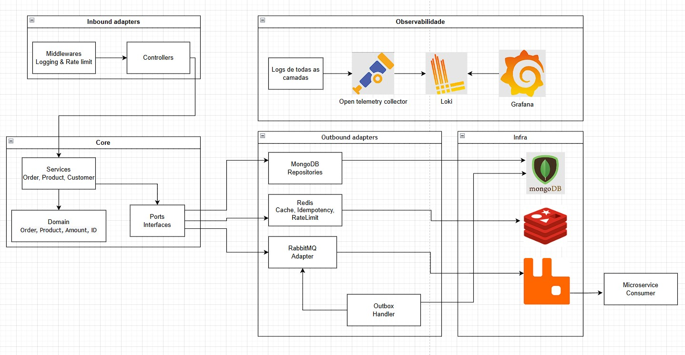
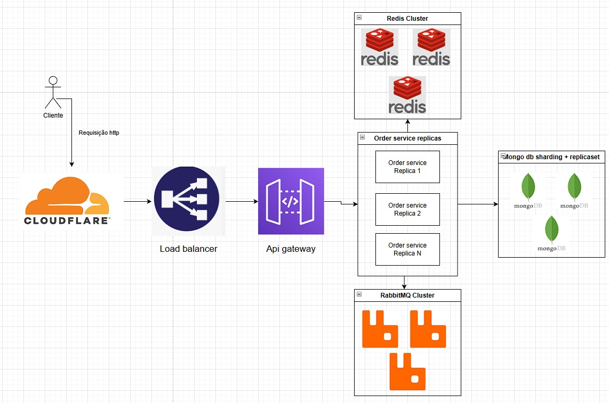

# Challenge API
API RESTful desenvolvida em Go para gerenciamento de pedidos com mensageria assíncrona e observabilidade.

## 📋 Stack Técnica

### Banco de Dados
- **MongoDB**: Utilizado como banco de dados principal, conforme requisito obrigatório do projeto. 

⚠️ **Importante**: As transações do MongoDB só funcionam com **Replica Set** habilitado. Instâncias standalone não possuem suporte a transações e causarão erros na aplicação. O `docker-compose.yml` fornecido já configura o MongoDB em modo Replica Set.

### Mensageria
- **RabbitMQ**: Sistema de mensageria para processamento assíncrono de eventos, conforme requisito obrigatório do projeto.

### Cache, Idempotência e Rate Limiting
- **Redis**: Utilizado para três finalidades:
  - Armazenamento de cache para otimização de performance
  - Gerenciamento de chaves de idempotência para evitar processamento duplicado de requisições
  - Rate limiting por rota via Lua script atômico (`INCR` + `EXPIRE`)

### Observabilidade

- **OpenTelemetry Collector**: Coletor de telemetria que centraliza o envio de logs. A principal vantagem é a flexibilidade: podemos alterar o destino dos logs (Loki, Elasticsearch, OpenSearch, etc.) apenas modificando o arquivo de configuração, sem necessidade de mudanças no código.

- **Loki**: Sistema de agregação de logs escolhido por sua simplicidade de configuração e baixo overhead operacional.

- **Grafana**: Interface para visualização de logs do Loki. Já vem pré-configurado com o datasource correto. Pode ser expandido para visualização de métricas no futuro.

## 🚀 Como Rodar o Projeto

O projeto possui duas configurações Docker Compose:

### 1. Ambiente Simples (docker-compose.yml)

Configuração básica com logs direcionados para stdout:

```bash
docker compose up -d
```

Nesta configuração:
- Logs são enviados para stdout/stderr
- `IS_PRODUCTION=false`
- Serviços: API, MongoDB, Redis, RabbitMQ

### 2. Ambiente com Observabilidade (docker-compose-full.yml)

Configuração completa com stack de observabilidade:

```bash
docker compose -f docker-compose-full.yml up -d
```

Nesta configuração:
- Logs são enviados para Loki via OpenTelemetry Collector
- `IS_PRODUCTION=true`
- Serviços: API, MongoDB, Redis, RabbitMQ, OpenTelemetry Collector, Loki, Grafana
- Acesse o Grafana em `http://localhost:3000` (usuário: `admin`, senha: `admin`)

### Portas Expostas

| Serviço | Porta | Descrição |
|---------|-------|-----------|
| API | 8080 | Endpoint HTTP da aplicação |
| MongoDB | 27017 | Banco de dados |
| Redis | 6379 | Cache e idempotência |
| RabbitMQ | 5672 | AMQP |
| RabbitMQ Management | 15672 | Interface de gerenciamento |
| Grafana | 3000 | Dashboard de logs |
| Loki | 3100 | Agregador de logs |
| OTEL Collector | 4317 | gRPC receiver |

## 🔍 Como Testar a API

### 1. Criar um Customer

```bash
curl -X POST http://localhost:8080/api/v1/customers \
  -H "Content-Type: application/json"
```

**Resposta**:
```json
{
  "id": "698bb701ec717b7a0d5ac8b0"
}
```

Anote o `id` retornado, pois será usado nos próximos passos.

### 2. Criar um Produto

```bash
curl -X POST http://localhost:8080/api/v1/products \
  -H "Content-Type: application/json" \
  -d '{
    "name": "Test Product",
    "description": "This is a test product",
    "price": 2999,
    "stock": 100
  }'
```

**Observações**:
- O preço é em centavos (2999 = $29.99)
- Anote o `id` do produto retornado

**Resposta**:
```json
{
  "id": "698bb701ec717b7a0d5ac8b1",
  "name": "Test Product",
  "description": "This is a test product",
  "price": 2999,
  "stock": 100
}
```

### 3. Criar um Pedido (com Idempotência)

```bash
curl -X POST http://localhost:8080/api/v1/orders \
  -H "Content-Type: application/json" \
  -H "Idempotency-Key: test-key-123" \
  -d '{
    "customer_id": "698bb701ec717b7a0d5ac8b0",
    "items": [
      {
        "product_id": "698bb701ec717b7a0d5ac8b1",
        "quantity": 1
      }
    ]
  }'
```

**Testando Idempotência**: Execute o mesmo comando novamente com a mesma `Idempotency-Key`. Você receberá a mesma resposta com o mesmo `order_id`, confirmando que o pedido não foi processado duas vezes.

**Resposta**:
```json
{
  "id": "698bb701ec717b7a0d5ac8b2",
  "customer_id": "698bb701ec717b7a0d5ac8b0",
  "items": [...],
  "status": "created",
  "total_amount": 2999
}
```

### 4. Atualizar Status do Pedido

```bash
curl -X PATCH http://localhost:8080/api/v1/orders/698bb701ec717b7a0d5ac8b2/status \
  -H "Content-Type: application/json" \
  -d '{
    "status": "processing"
  }'
```

**Resposta**:
```json
{
  "id": "698bb701ec717b7a0d5ac8b2",
  "status": "processing"
}
```

### 📚 Documentação OpenAPI/Swagger

A especificação da API está disponível nos arquivos `docs/swagger.yaml` e `docs/swagger.json`, gerados automaticamente via `swaggo` a partir das anotações nos controllers.

> **Nota**: O Swagger UI não é servido pela aplicação em runtime. Para visualizar a documentação, importe o arquivo em ferramentas como [Swagger Editor](https://editor.swagger.io/), Postman ou Insomnia.

## 🧪 Testes Unitários

### 1. Instalar Ferramenta de Cobertura

```bash
go install github.com/vladopajic/go-test-coverage/v2@latest
```

### 2. Executar Testes

**Importante (Windows)**: Certifique-se de que o Docker Desktop está rodando, pois alguns testes utilizam Testcontainers para testar os adapters (camadas externas).

```bash
go test ./... -coverprofile=coverage.out
```

### 3. Verificar Cobertura

```bash
go-test-coverage --config=./.testcoverage.yml
```

**Cobertura Atual**: 61.7%

### Paths Excluídos da Cobertura

Os seguintes paths foram excluídos da análise de cobertura por não necessitarem de testes unitários:

```yaml
exclude:
  paths:
    - ^cmd/              # Entrypoint da aplicação
    - /port/             # Interfaces/portas
    - /config/           # Arquivos de configuração
    - ^docs/             # Documentação
    - /serviceerrors/    # Definições de erros
    - /logger/           # Implementação de logger
    - /mock/             # Mocks para testes
    - /document/         # Modelos de dados
    - /dto/              # Data Transfer Objects
    - router.go          # Configuração de rotas
```

**Justificativa**: Esses arquivos não contêm lógica de negócio relevante (mocks, DTOs, configurações, logger, documentação, entrypoint inicial), sendo desnecessário testá-los unitariamente.

## 🏗️ Decisões Técnicas

### 1. Outbox Pattern

Implementamos o **Outbox Pattern** para envio de eventos ao RabbitMQ:

- Eventos são salvos em uma tabela outbox no MongoDB dentro da mesma transação da operação principal
- Um worker separado processa e envia os eventos
- **Garantia**: At-least-once delivery
- **Importante**: Consumidores devem implementar lógica de deduplicação ou serem idempotentes, pois eventos podem ser entregues mais de uma vez

### 2. Idempotência de Requisições

Implementamos chaves de idempotência seguindo o modelo do Stripe:

- **Evita processamento duplicado**: Se o usuário sofrer problemas de rede e reenviar a requisição, ela não será processada novamente
- **Validação de integridade**: Fazemos hash do body da requisição. Se o body mudar com a mesma chave de idempotência, a segunda requisição falha
- **Espera ativa**: Se uma requisição ainda está sendo processada e chega outra com a mesma chave, a segunda aguarda a conclusão da primeira e retorna o mesmo resultado
- **Armazenamento**: Redis é usado para gerenciar as chaves de idempotência

### 3. Transações do MongoDB

Utilizamos transações ACID do MongoDB para garantir consistência:

- **Atomicidade**: Decrementamos o estoque e criamos a ordem na mesma transação
- **Prevenção de data races**: Operações concorrentes são isoladas
- **Rollback automático**: Se qualquer operação falhar, toda a transação é revertida
- **FindOneAndUpdate atômico**: Usamos esta operação para decrementar o estoque e validar disponibilidade atomicamente, evitando race conditions

### 4. Estratégia de Testes

- **Testcontainers**: Testamos todas as camadas, incluindo adapters (camadas externas), usando containers reais do MongoDB, Redis e RabbitMQ
- **Testes de Arquitetura**: Validamos que não há violações arquiteturais no código (ex: service importando adapter diretamente)
- **Testes de Integração E2E**: Teste completo de ponta a ponta simulando fluxo real
- **Cobertura significativa**: 61.7% excluindo arquivos que não requerem testes

### 5. Logging Estruturado

- Todas as requisições HTTP são logadas com:
  - Status code
  - Duração da requisição
  - Path e método
  - Informações de erro (quando aplicável)
- **Possibilidades futuras**: Dashboards no Grafana com gráficos de latência média, taxa de erro, throughput, etc.

## ⚙️ CI (GitHub Actions)

Pipeline de integração contínua executado em todo push e pull request, com **6 jobs em paralelo**:

| Job | O que faz |
|-----|-----------|
| **Tests & Coverage** | Executa todos os testes com race detector (`-race`), gera relatório de cobertura e falha se estiver abaixo de 60% |
| **Format Check** | Valida formatação (`gofmt -s`) e organização de imports (`goimports`) |
| **Go Vet** | Análise estática nativa do Go para detectar erros comuns |
| **Static Analysis** | `staticcheck` para detectar bugs, código morto e padrões incorretos |
| **Golangci-lint** | Linting abrangente com múltiplos linters configurados em `.golangci.yml` |
| **Security Scan** | `gosec` para detectar vulnerabilidades de segurança no código |

O pipeline de **CD** é acionado automaticamente após o CI passar na branch `main`. Atualmente realiza apenas o **build da imagem Docker** (multi-stage com cache via GitHub Actions), pois não há infraestrutura de destino configurada. Em um cenário real, bastaria adicionar o step de push para um registry (ECR, GHCR, etc.) e deploy (Kubernetes, ECS, etc.).

## 📐 Diagramas de Arquitetura

### 1. Arquitetura Hexagonal (Microsserviço)



O serviço segue Arquitetura Hexagonal com separação clara entre Core (domain, services, ports) e Adapters (HTTP/Gin, MongoDB, Redis, RabbitMQ). Requests HTTP entram pelos controllers (inbound adapter), passam pelos services no core que orquestram a lógica de negócio usando interfaces (ports), e os adapters outbound implementam a persistência, cache e mensageria. Eventos de atualização de status são salvos via Outbox Pattern na mesma transação do MongoDB e publicados assincronamente no RabbitMQ para serviços consumidores.

### 2. Estratégia de Escalabilidade



O fluxo de produção segue: **Client → Cloudflare → Load Balancer → API Gateway → N réplicas do Order Service**.

Cada réplica é stateless e se conecta a três clusters compartilhados:

- **MongoDB (Sharding + Replica Set)**: Sharding distribui os dados horizontalmente por shard key (ex: `customer_id`), permitindo crescimento linear de throughput conforme o volume de pedidos aumenta. Cada shard opera com Replica Set para alta disponibilidade e failover automático. Transações ACID são suportadas inclusive em operações cross-shard.

- **Redis Cluster**: Cache distribuído com particionamento automático por hash slots. Garante que idempotência, rate limiting e cache de pedidos funcionem de forma consistente independente de qual réplica da API recebe a requisição.

- **RabbitMQ Cluster**: Cluster com quorum queues para durabilidade. Eventos publicados via Outbox Pattern são consumidos por serviços externos (notificação, analytics, shipping) de forma desacoplada.

**Cloudflare** atua como primeira camada de proteção (DDoS, WAF, CDN para assets estáticos). O **API Gateway** centraliza autenticação, rate limiting global e roteamento, enquanto o **Load Balancer** distribui tráfego entre réplicas via round-robin ou least-connections. Essa arquitetura permite escalar cada componente de forma independente conforme o gargalo identificado.

